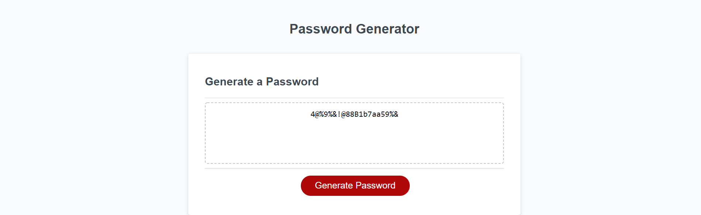

<br>
<p align="center">
   <h2 align="center">Password Generator</h2>
</p>
<br>

## About the project
This is a password generator that uses random characters to generate a password and show it on the main page. It utilizes Javascript as the primary language. I used a loop to generate a password based off of certain conditions inputted by the user regarding which characters they would like to use in their randomized password. 

### How to view project

To view this project, simply go to https://zd092718.github.io/zdpasswordgenerator/ to view the finished product. 

To see the code for the site:

* Clone the repo

    ```sh
    git clone https://github.com/Zd092718/zdpasswordgenerator
    ```

### Built With

* HTML5
* CSS3 
* Javascript

### Preview Image



## Contact

Zachary Dowd - zdowd2796@gmail.com

Project Link - https://github.com/Zd092718/zdpasswordgenerator